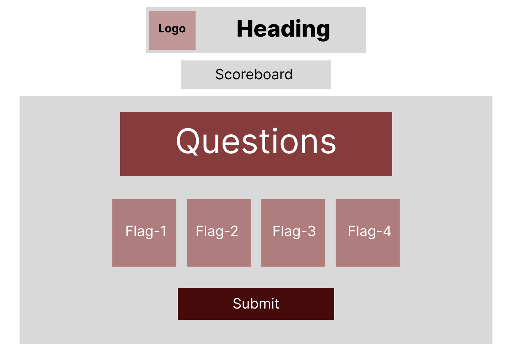
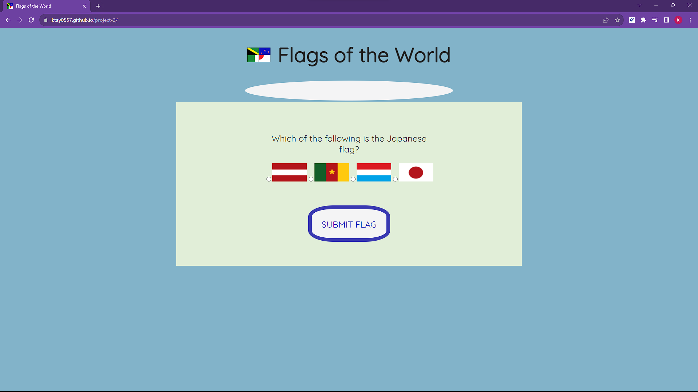
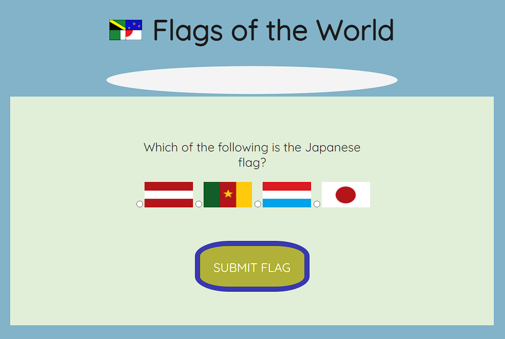
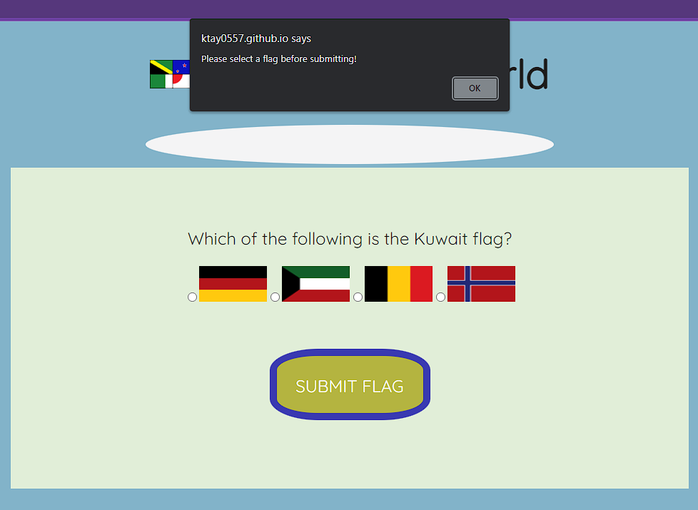
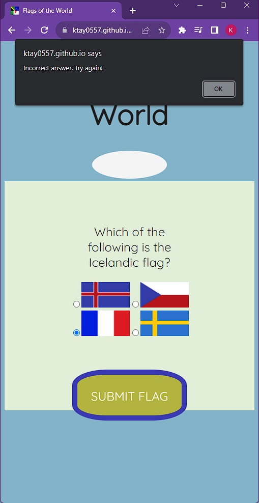
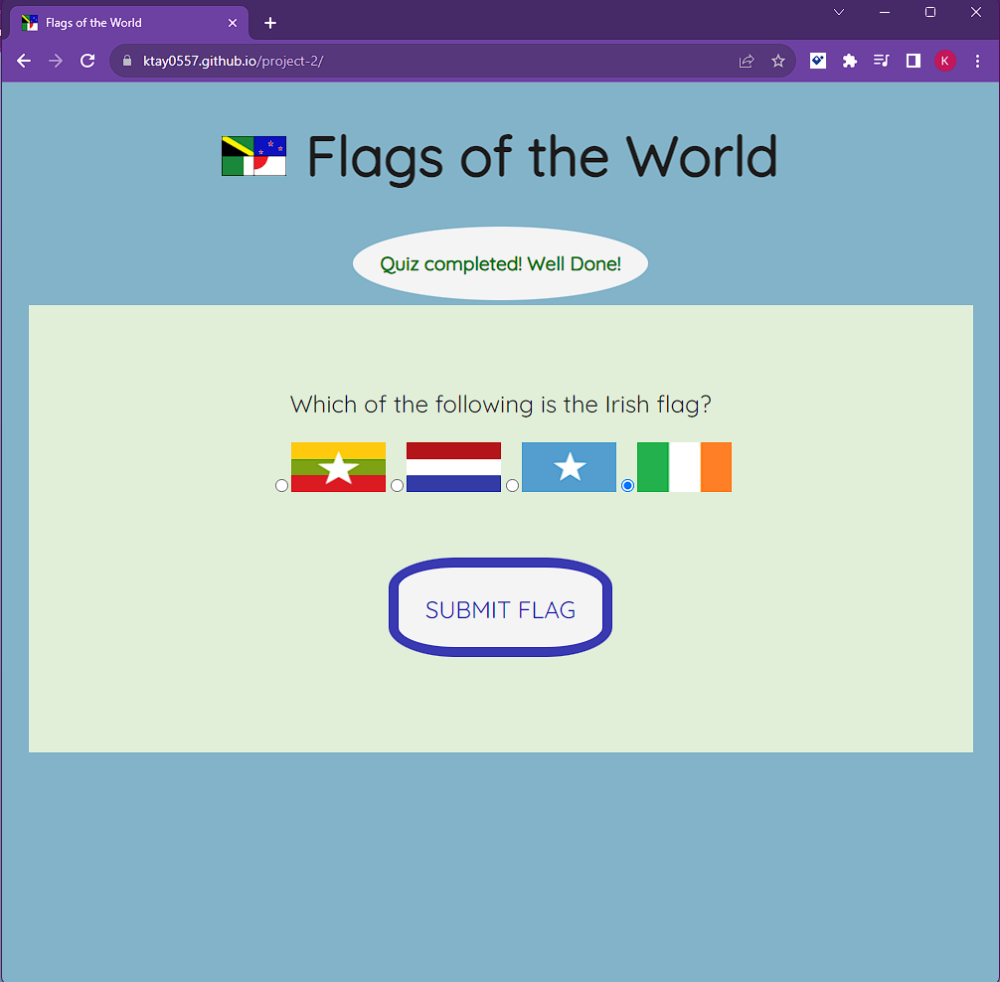

# Project 2 - Flags of the World

[Flags of the World](https://ktay0557.github.io/project-2/)

A quick and fun little quiz to test the users knowledge of flags from around the world. It will be designed to allow for accessibility across a range of devices.

A screenshot of the initial wireframe to show the rough idea of where the main sections will be.

The first thing users see once the site has finished loading.

Color-changing submit button, for interactivity for the user.

Various alerts to ensure the user knows what to do and what is happening. One for if nothing is selected, one for if the wrong answer if chosen, and one for when the right answer is achieved.

Screenshot to show how the site responds to different screen sizes.

Text appears when the user has completed the quiz successfully.

## User Experience (UX)

### User stories

- Goals for First Time Visitors:

  - As a newcomer to the site, I want to be able to easily understand the main purpose of the site and test my knowledge of world flags.

  - As a newcomer to the site, I want to be able to easily navigate the site and be able to interact with the site.

- Goals for Returning Visitors:

  - Being a returning visitor, I am interested in improving my knowledge of world flags.

- Goals for Regular Users:

  - As a regular user, I want to see if there is any newly added questions.

  - As a regular user, I want to check for any new quizes.

## Technologies Used

### Languages Used

- HTML

- CSS

- Javascript

### Frameworks, Libraries, and Programs Used

1. GitHub:
   - GitHub is used to store the project codes after being pushed from Codeanywhere.
2. Git:
   - Git is used for version control, to enable commits to Git and the ability to Push to GitHub.
3. Google Fonts:
   - Google Fonts was used throughout the website, for aesthetic purposes in regards to the text.
4. Hover.css:
   - Hover.css was used on the submit flags button to add color changes when hovered over.
5. Paint:
   - Paint was used for creating images, resizing images and creating the favicon.

## Testing

The project was validated using JSHint and the W3C Markup Validator, in order to ensure that the project contained no errors.

[JSHint - Results](assets/images/jshint_results.png)

[W3C Markup Validator - Results](assets/images/w3c_validator_results.png)

[W3C CSS Validator - Results](assets/images/w3c_css_validator_results.png)

The first images for the answers did not want to load when previewing the website. This was a quick fix, as the file pathway was written incorrectly.
JSHint flagged an unnecessary semi-colon on ln69, which has since been removed, and the W3C CSS Validator noted a padding value error which had been left in on ln27, again, this has since been removed.

With more time, I would like to add more questions and a fully functioning scoreboard with current scores. Also, a possibility of adding more quizes to give the user a range of options when they visit the site.

## Testing User Stories from UX Section

- Goals for First Time Visitors:

  - As a newcomer to the site, I want to be able to easily understand the main purpose of the site and test my knowledge of world flags.

        a. Once the user has entered the site, it is clear what the site is about thanks to the logo and heading 'Flags of the World'.
        b. The first question of the quiz also greets the user upon loading the site.

  - As a newcomer to the site, I want to be able to easily navigate the site and be able to interact with the site.

        a. Users can see that there is a quiz with various answer options.
        b. Alerts are in place to ensure visitors understand what is required to complete the quiz.

- Goals for Returning Visitors:

  - Being a returning visitor, I am interested in improving my knowledge of world flags.

        a. As a returning visitor, the user may try completing the quiz again without any incorrect answers.

- Goals for Regular Users:

  - As a regular user, I want to see if there is any newly added questions.

        a. Regular users will be able to complete the quiz and see if new questions have been added.

  - As a regular user, I want to check for any new quizes.

        a. If new quizzes are added, the user will be able to see from any new options that may appear on the site.

## Deployment

### GitHub Pages

The project was deployed to GitHub Pages using the following steps:

    1. Logged into GitHub and went to the specific GitHub Repository.
    2. In the Repository page, clicked on the "Settings" cog at the top of the page.
    3. In the "Code and automation" area, selected "Pages".
    4. Under "Source" option, choose "Deploy from a branch", followed by "main" and "/(root)".
    5. Refreshed the page, and at the top of the page is the published site link within "GitHub Pages" area.

### Forking the GitHub Repository

By forking the GitHub Repository, a copy can be created. This allows for viewing and editing, without affecting the original. The following steps show how:

    1. Log into GitHub, locate the GitHub Repository.
    2. "Fork" is towards the top of the page, select it.
    3. This provides a copy of the original repository.

### Making a Local Clone

    1. Start by logging into GitHub.
    2. Locate the required GitHub Repository.
    3. Click the "<> Code" dropdown option.
    4. The link can be copied and cloned. 

## Credits

### Code

- Code Institute: The JavaScript modules provided knowledge required to put together the code.
- Stack Overflow: Helped with getting an understanding of how to get the functions to work during the set up stages, when I was making small errors and unsure where I was going wrong.

### Content

- All content was written by the developer.

### Media

- All images were created by the developer in paint, with reference to WikiMedia to make sure the flags were drawn correctly.

### Acknowledgements

- Kevin for keeping me motivated for the website.
- Abi for their continued support, and allowing me to talk things through and get them straight.
- Code Institute, as always, as their short and sweet lessons make this more manageable.
